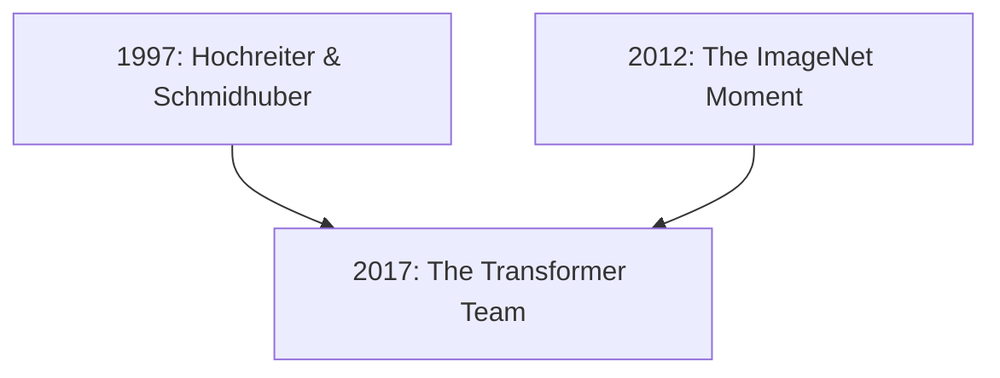

## **The Transformer Team: Attention Is All You Need (2017)**

### **The People**

A group of eight researchers at Google Brain (including **Ashish Vaswani**, **Noam Shazeer**, and **Aidan Gomez**). They were frustrated by the slow, sequential nature of existing AI and sought a way to make training faster and more "attentive."

### **What They Inherited (The Shoulders)**

* **The LSTM Team (1997):** They inherited the goal of solving "long-range dependencies." While LSTMs tried to remember the past, the Transformer Team decided to simply "look" at the whole sequence simultaneously.
* **The Backprop Team (1986):** They inherited the fundamental engine of gradient descent.
* **Bahdanau, Cho, & Bengio (2014):** They inherited the early concept of **"Attention"**—the idea that a model should focus on specific words in a sentence when translating. They took this small idea and made it the *entire* architecture.

### **What They Passed On**

* **Self-Attention:** They passed on the ability for a model to weigh the importance of every part of the input data relative to every other part.
* **Parallelization:** They passed on a design that could be trained on massive clusters of GPUs much faster than LSTMs, enabling the "Big Data" era of AI.
* **The Foundation for LLMs:** Every "GPT" (Generative Pre-trained **Transformer**), Claude, and Gemini model today is a direct descendant of this 2017 architecture.

---

### **Updating the Graph (`docs/graphs.md`)**

Add this final modern node and its connections:

### **The Full Story Now Told**

With this addition, your repository now tracks a continuous line of thought from **Babbage's gears** in 1837 to the **Self-Attention** math of 2017 that powers the AI you're using to build this project.

**Would you like me to help you update the `docs/lineage/README.md` table to include this final 2017 entry?**